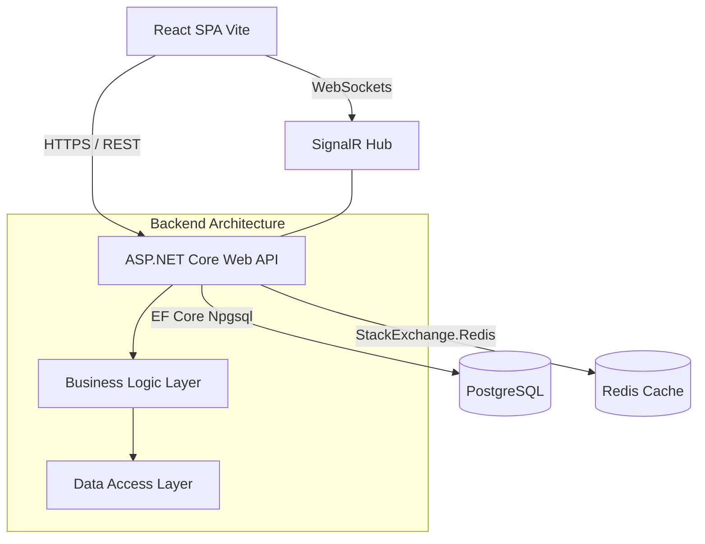

# NovaStaff - Enterprise Human Resource Management System

<div align="center">


**NovaStaff** is a comprehensive, enterprise-grade Human Resource Management System designed to streamline organizational workflows, attendance tracking, payroll, and internal communication.

[Features](#key-features) • [Architecture](#architecture) • [Getting Started](#getting-started) • [Documentation](#documentation)
</div>

---

## 🚀 Key Features

- **🛡️ Secure Authentication**: JWT-based authentication, role-based access control, and secure account activation flows.
- **🏢 Advanced Organization Tree**: Hierarchical department management utilizing the Materialized Path pattern for infinite nesting capabilities.
- **👥 Employee Management**: Detailed profiles, contract tracking, and lifecycle management.
- **📅 Time & Attendance**: Real-time attendance logging, leave request workflows with multi-level approvals.
- **💰 Payroll Automation**: Dynamic salary calculation considering base pay, allowances, deductions, and actual working days.
- **📋 Kanban Task Board**: Visual work task tracking across different departments.
- **💬 Real-time Communication**: Integrated instant messaging using SignalR (REST fallback) with channels and direct messages.

## 🏗 Architecture

The system is built on a modern decoupled architecture:



### Tech Stack
* **Backend**: ASP.NET Core 8.0, Entity Framework Core, SignalR, JWT
* **Frontend**: React 18, TypeScript, Vite, TailwindCSS / AntD (Context-based)
* **Database & Cache**: PostgreSQL 16, Redis 7
* **Infrastructure**: Docker & Docker Compose

## 💻 Getting Started

### Prerequisites
* **.NET 8.0 SDK**
* **Node.js 18+ & npm**
* **Docker** (Recommended for DB & Cache)

### 1. Infrastructure Setup (Docker)
The easiest way to get the databases running is via Docker Compose:
```bash
docker-compose up -d db redis
```

### 2. Backend Setup
```bash
# Navigate to API directory
cd NovaStaff.Api

# Apply Entity Framework Core Migrations
dotnet ef database update --project ../NovaStaff.DataLayes --startup-project .

# Run the API server
dotnet run
```
*API will be available at `http://localhost:5102`*

### 3. Frontend Setup
```bash
# Navigate to Web directory
cd SV22T1020320.Web

# Install dependencies
npm install

# Start development server
npm run dev
```
*Frontend will be available at `http://localhost:5173`*

## 📚 Documentation
Detailed documentation can be found in the respective directories:
- **[Backend Architecture](ARCHITECTURE.md)**: Layered design, dependency injection, and data models.
- **[Frontend Docs](SV22T1020320.Web/docs/)**: Component hierarchy, state management, and routing.

## 🤝 CI/CD Pipeline
This repository includes a GitHub Actions workflow (`.github/workflows/build.yml`) that automatically builds both the .NET solution and the React frontend on every Push or Pull Request to the `main` branch, ensuring code integrity and continuous integration.

---
*Official Release v1.0.0 - University Report Product*
